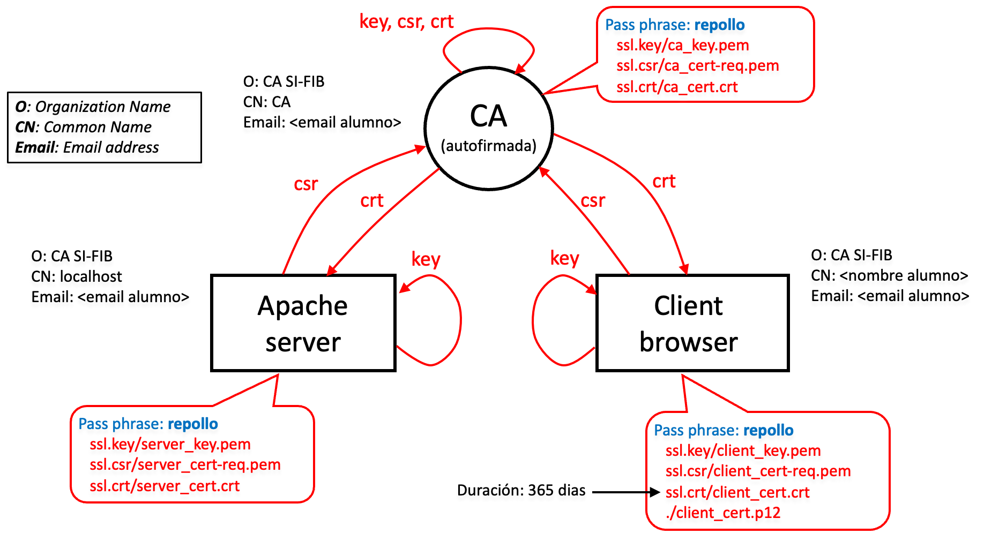

# Laboratorio 1

## Certificados Digitales

### Objetivo

El objetivo del laboratorio es doble en primer lugar, familiarizarse con openssl que es una herramienta de código abierto para gestionar certificados digitales en PKI, con el formato de los certificados digitales y la información que contienen. En segundo lugar, aprender a configurar un servidor web Apache para utilizar conexiones HTTP seguras con los protocolos Secure Sockets Layer y Transport Layer Security (SSL/TLS) con solo autenticación de servidor o con autenticación de cliente/servidor.

Apache es un servidor HTTP de código abierto para sistemas operativos Unix y Windows. Apache usa *mod_ssl* como módulo para admitir SSL v2/v3 y TLS v1. También utiliza la herramienta openssl para admitir las funcionalidades criptográficas.

### Configurando la VM y Apache

Para esta sesión utilizaremos una máquina virtual Debian usando
Vagrant.

Para ello descargaremos Vagrant desde <https://www.vagrantup.com/>.

Vagrant permite autoconfigurar la máquina, por lo que crearemos un directorio para el laboratorio y descargaremos el Vagrantfile desde:

https://github.com/reneserral/smartcities-security/raw/main/lab-certificados/Vagrantfile

Abriremos un terminal en este directorio y ejecutaremos:

```
vagrant up apache
```

Este comando va a crear y configurar la máquina virtual, el proceso puede tardar unos minutos la primera vez.

Una vez el proceso ha terminado se debe ejecutar:

```
vagrant ssh apache
```

Para realizar la práctica se va a usar openssl es un conjunto de utilidades para emitir y gestionar pares de claves asimétricas, certificados digitales en formato X.509v3, CRL, etc. La máquina virtual ya tiene una versión ya instalada en: `/usr/bin/openssl`.

**Nota:** en caso de que no puedas encontrarlo allí, puedes usar el comando:

```
whereis openssl
```

Para encontrarlo.

Como comentamos anteriormente, el otro software que vamos a utilizar es Apache, que también está incluido.

El servidor Apache se instalará en `/usr/sbin/apache2`. Para configurar apache2, usaremos los archivos `/etc/apache2/ports.conf` y los archivos de configuración de VirtualHost que deberían estar en `/etc/apache2/sites-available`. El primer archivo contiene los puertos que utiliza el servidor para escuchar las conexiones entrantes. El segundo archivo se utiliza para configurar el comportamiento del sitio web. En particular para nuestro caso, incluirá las opciones que utiliza el servidor para abrir conexiones SSL y encontrar su clave privada, su certificado, las CA confiables, etc.

Para iniciar apache2 y editar algunos de los archivos de configuración, necesitamos acceso de root.

Finalmente, necesitamos crear una estructura de directorios para facilitar la gestión de los datos:

- **ssl.key:** directorio para almacenar las claves criptográficas.

- **ssl.csr:** directorio para almacenar las solicitudes de certificados digitales.

- **ssl.crt:** directorio para almacenar los certificados digitales.

Para crear el conjunto completo de directorios en la VM, utiliza el siguiente comando:

```
mkdir -p $HOME/si/ssl.{key,csr,crt}
```

### Esquema

La siguiente figura muestra un esquema de esta práctica. En particular, podemos ver las diferentes entidades involucradas y sus relaciones, así como los valores de los atributos que deben configurarse.

:

### Creando la jerarquía de certificación

El primer paso consiste en crear nuestra jerarquía de certificación con una sola Autoridad de Certificación (CA). Eso significa crear el certificado raíz de la CA.

**Advertencia:** te recomendamos anotar todas y cada una de las contraseñas que utilices para cada certificado. Como sugerencia para facilitar esta tarea, puede utilizar la misma “Passphrase” y contraseña, por ejemplo repollo en todos los lugares. Esta **NO** es una buena práctica y, en escenarios reales, **NO** se recomienda en absoluto. En esta práctica sugerimos esto sólo para evitar cualquier posible problema relacionado con nuestra memoria (o falta de ella).

#### Generando la solicitud de certificado para la CA

Este paso consiste en generar un par de claves. La clave privada se almacenará en un archivo protegido por contraseña (*ca_key.pem*), mientras que la clave pública (junto con la información que queremos que contenga el certificado) se almacenará en el archivo de solicitud de certificado (*ca_cert-req.pem*).

```
openssl req -new -extensions v3_ca -keyout ssl.key/ca_key.pem \
  -out ssl.csr/ca_cert-req.pem
```

Para la generación de estos archivos, se le solicitará que indique una contraseña (dos veces por seguridad) y los diferentes atributos del certificado, por ejemplo, País, Estado, Nombre de la organización, Nombre común, etc. Como se comentó anteriormente, sugerimos utilizar la Passphrase *repollo*. En cuanto a los atributos, vamos a utilizar únicamente los valores indicados en la para la CA, es decir, Nombre de la organización, Nombre común y dirección de correo electrónico. Los atributos restantes no se especificarán: cuando se solicite, deberá ingresar un punto ".", que indica un atributo vacío.

Puede comprobar el contenido de los dos archivos: uno que contiene la clave privada y el otro que contiene la solicitud de certificado.

El siguiente paso es analizar la solicitud de certificado utilizando la utilidad asn1parse de openssl:

```
openssl asn1parse -i -dump -in ssl.csr/ca_cert-req.pem \
  ssl.csr/ca_cert-req.txt
```

Puedes consultar el nuevo archivo de texto e identificar los campos que contienen la información proporcionada cuando se generó la solicitud y la clave pública.

#### Emitir la firma del certificado de la CA

Este paso consiste en generar el certificado autofirmado de la CA:

```
openssl req -new -x509 -in ssl.csr/ca_cert-req.pem \
  -out ssl.crt/ca_cert.crt -days 365 -key ssl.key/ca_key.pem
```

Debes utilizar la contraseña establecida en el paso anterior. Puedes analizar el nuevo certificado e identificar los campos que contienen la información introducida y la clave pública usando:

```
openssl asn1parse -i -dump -in ssl.crt/ca_cert.crt \
  ssl.crt/ca_cert.txt
```

Una vez configurada la CA, podemos pasar a la configuración del
servidor.

#### Generando la solicitud de certificado para el servidor

El SAN (Subject Alternative name) es una extensión de X.509 que
permite asociar varios valores a un certificado de seguridad. RFC-2818 (mayo de 2000) especifica los nombres alternativos del *"Subject"* como el método preferido para agregar nombres DNS a los certificados.

En esta práctica de laboratorio, usaremos localhost/127.0.0.1 como nombre de dominio cuando naveguemos por nuestra página. Necesitamos configurar los valores SAN IP/DNS adecuados en consecuencia.

En primer lugar, necesitamos crear una configuración personalizada2 (*server_cert.cnf*) para que openssl proporcione los valores de *subjectAltName*:

```
[req]
distinguished_name = req_distinguished_name
x509_extensions = v3_req
req_extensions = req_ext

[req_distinguished_name]
0.organizationName = Organization Name (eg, company)
0.organizationName_default = Internet Widgits Pty Ltd
commonName = Common Name (e.g. server FQDN or YOUR name)
commonName_max = 64
emailAddress = Email Address
emailAddress_max = 64

[req_ext]
subjectAltName = @alt_names

[alt_names]
IP.1 = 127.0.0.1
DNS.1 = localhost

[v3_req]
basicConstraints = CA:FALSE
keyUsage = nonRepudiation, digitalSignature, keyEncipherment
```

Ahora se emitirá la solicitud de certificado para el servidor:

```
openssl req -new -extensions v3_req -keyout ssl.key/server_key.pem \
  -out ssl.csr/server_cert-req.pem -config server_cert.cnf
```
Para este certificado, debe usar la opción `-extensions v3_req` y no `v3_ca` utilizada antes para la CA. Openssl proporciona un conjunto de perfiles de certificado descritos en su archivo de configuración openssl.cnf. En este caso, utilizamos el perfil de una entidad que no es una CA.

**Advertencia**:
- Al emitir la nueva solicitud, ten cuidado con el nombre del archivo para no reescribir las solicitudes anteriores.
- Utiliza los valores de atributos indicados en la para el servidor web.

Una vez emitida la solicitud, puede verificar si está bien formada usando el comando:

```
openssl req -in ssl.csr/server_cert-req.pem -text -verify
```

### Emitir la firma del certificado del servidor

Ahora este certificado no está autofirmado: lo debe firmar la CA. Por tanto, el siguiente comando genera el certificado de servidor firmado por la CA con una duración de 1 año. La CA firmará este certificado con su *“Passphrase”*:

```
openssl x509 -req -in ssl.csr/server_cert-req.pem \
  -out ssl.crt/server_cert.crt -days 365 -CA ssl.crt/ca_cert.crt \
  -CAkey ssl.key/ca_key.pem -CAcreateserial -extfile server_cert.cnf \
  -extensions req_ext
```

**Advertencia:** Las extensiones en los certificados no se transfieren a las solicitudes de certificados y viceversa. Debido a esto, las extensiones que agregamos en nuestro CSR no se transfirieron por defecto al certificado. Por lo tanto, estas extensiones deben agregarse explícitamente al certificado.

Puedes analizar el nuevo certificado para comprobar que la información es correcta:

```
openssl asn1parse -i -dump -in \
  ssl.crt/server_cert.crt > ssl.crt/server_cert.txt
```

Podemos verificar que el certificado esté bien formado usando el
comando:

```
openssl x509 -in ssl.crt/server_cert.crt -text
```

Verifica que la configuración que especificamos esté configurada correctamente en el certificado del servidor:

```
openssl x509 -in ssl.crt/server_cert.crt -text | grep -A1 Subject

  Subject: O = CA SI-FIB, CN = localhost, emailAddress = xxx@upc.edu**
    Subject Public Key Info:

    Public Key Algorithm: rsaEncryption
    ...
  
  X509v3 Subject Alternative Name:

  IP Address:127.0.0.1, DNS:localhost
```

#### Generando un certificado para el usuario

En este paso generaremos el certificado para que el usuario (indicado como cliente) sea correctamente autenticado por el servidor web. El proceso es similar al que ya hicimos para el certificado del servidor web.

```
openssl req -new -extensions v3_req -keyout ssl.key/client_key.pem \
  -out ssl.csr/client_cert-req.pem
```

Una vez emitida la solicitud, puedes verificar si está bien formada usando el comando:

```
openssl req -in ssl.csr/client_cert-req.pem -text -verify
```

#### Emitir la firma del certificado de usuario 

Como ya hicimos con el servidor, ahora necesitamos la firma de la CA para el certificado del cliente.

```
openssl x509 -req -in ssl.csr/client_cert-req.pem \
  -out ssl.crt/client_cert.crt -days 365 -CA ssl.crt/ca_cert.crt \
  -CAkey ssl.key/ca_key.pem -CAcreateserial
```

También puede analizar el certificado para verificar los diferentes campos y verificar su corrección, como ya hizo para el servidor (aquí se omiten comandos específicos).

#### Exportar el certificado de usuario y su clave privada

Este paso consiste en exportar el certificado de usuario, para luego importarlo en el navegador. El siguiente comando crea un único archivo que sigue el PKCS#12 y estará protegido por una contraseña.

```
openssl pkcs12 -export -in ssl.crt/client_cert.crt \
  -inkey ssl.key/client_key.pem -out client_cert.p12 -name "clientCert"
```

**Advertencia:** Mantén este archivo .p12 seguro y no olvides la
contraseña porque será necesaria para la configuración del cliente del navegador. Además, si creaste este archivo con credenciales de root, deberá cambiar su permiso de lectura (chmod) para que Firefox pueda leer e importar el archivo.

#### Instalar los certificados en el navegador

En primer lugar, necesitamos importar el certificado de CA en el navegador Firefox y luego el certificado de usuario.

Abre el navegador Firefox. Abre el menú con el ícono de 3 líneas horizontales en el lado derecho y selecciona Preferencias. Ve a **Privacidad y seguridad**, baja hasta *Certificados* y haz clic en *Ver certificados*. Puedes ver la lista de CA confiables en la pestaña Autoridades. Debes desplazarte hacia abajo y encontrar el botón *Importar*. Aquí debes importar el certificado de CA: busca el archivo ca_cert.crt y selecciona *Abrir*. Puedes examinar el certificado de CA (y verificar si los atributos aún son correctos). Ante la pregunta **¿Quiere confiar en CA para los siguientes fines?** selecciona ambas opciones y haz clic en *Aceptar*. Puedes comprobar si nuestra CA ha sido importada. Si es así, haz clic en *Aceptar*.

Ahora podemos importar el certificado de usuario. Haga clic en *Ver certificados* nuevamente. Ve a *Sus certificados*, desplázate hacia abajo y haz clic en *Importar*. Busca el archivo client_cert.p12 y selecciona *Abrir*. Se solicitará la contraseña del archivo. Puedes abrir el certificado y volver a verificar si los atributos son correctos.

### Configuración Apache

#### Start/Stop/Restart el servidor apache

```
sudo systemctl start apache2
```

Necesitarás tener acceso de root para hacerlo. Luego inicia el navegador web y conéctate a localhost (o *http://127.0.0.1*). Si ves una página de presentación, significa que Apache está instalado correctamente.

Para parar el servidor:

```
sudo systemctl stop apache2
```

Para reiniciar el servidor:

```
sudo systemctl restart apache2
```

Para validar la configuración:

```
sudo apachectl configtest
```

**Advertencia:** cada vez que cambias la configuración de cualquier archivo, debes reiniciar el servidor web.

#### Configuración de Apache para autenticar el servidor

Queremos que el servidor ofrezca su certificado al navegador, entonces necesitamos habilitar SSL en Apache2.

Edita el contenido de ports.conf (en `/etc/apache2`) para que Apache escuche las solicitudes HTTPS: normalmente dichas solicitudes se dirigen a los puertos 443, 4443, etc. Verifica que el archivo ya contenga:

```
Listen 80
<IfModule ssl_module>
  Listen 443
</IfModule>

<IfModule mod_gnutls.c>
  Listen 443
</IfModule>
```

La directiva `IfModule` evalúa si `ssl_module` está habilitado. Para habilitarlo, puede usar el siguiente comando:

```
sudo a2enmod ssl
```

Ahora reinicia Apache para cargar el módulo.

#### Configurar un VirtualHost para usar SSL

Comprueba el contenido del archivo predeterminado de SSL en el directorio /etc/apache2/sites-available para familiarizarse con la estructura de dichos archivos:

1.  Abre el fichero `default-ssl.conf`

2.  La variable *DocumentRoot* indica dónde está el árbol de directorios que contiene las páginas web de este VirtualHost. Puedes cambiar el contenido de la página de inicio para asegurarte de que se está conectando al VirtualHost configurado con SSL, es decir, cambiar del sitio predeterminado /var/www/html a /var/www-ssl.

3.  Verifica que contenga *SSLEngine* activado y agrega justo después la opción:
```
    SSLProtocol -all +TLSv1.1 +TLSv1.2
```
para habilitar el protocolo TLS solo para las versiones 1.1 y 1.2 (las más antiguas son inseguras):

```
SSLEngine on
SSLProtocol -all +TLSv1.1 +TLSv1.2
```

4.  Configura las variables del certificado para que apunten al servidor y al certificado de CA.

```
SSLCertificateFile /home/alumne/si/ssl.crt/server_cert.crt
SSLCertificateKeyFile /home/alumne/si/ssl.key/server_key.pem
SSLCACertificateFile /home/alumne/si/ssl.crt/ca_cert.crt
```

**Advertencia:** Cambia el directorio /home/alumne/si/ al que corresponda en tu equipo, tiene que ser la ruta absoluta donde residen los directorios ssl.crt y ssl.key.

5.  Apache realiza control de acceso, por lo que necesitamos habilitar el acceso a sus páginas web.

```
<Directory "/var/www-ssl">
  AllowOverride All
  Require all granted
</Directory>
```

6.  Crea el directorio `/var/www-ssl` y un nuevo archivo index.html con el siguiente contenido

```
<html>
  <body>
    <h1>SSL</h1>
    <hr>
    <h2>Server with SSL active</h2><ul>
  </body>
</html>
```

#### Habilitar el nuevo sitio web
El siguiente paso habilita este nuevo sitio web en el servidor:

```
sudo a2ensite default-ssl
```

Ahora necesitas reiniciar Apache2 para recargar todos los cambios. Si no hay ningún error, se pedirá una contraseña para desbloquear la clave privada del servidor. Ahora puedes intentar conectarte al nuevo sitio web https://localhost mediante una conexión segura (asegúrate que sea HTTPS). Si la configuración es correcta, deberías poder ver la nueva página web. Puedes hacer clic en el ícono del candado justo en el lado izquierdo de la URL y verificar que la conexión sea segura (candado verde). Puedes hacer clic en la flecha derecha para ver los detalles de la conexión y verificar el nombre de la entidad que certifica la conexión. Pulsando en *Más información* podrás ver los detalles del certificado.

**Advertencia:** Si ves una advertencia que dice que el nombre del servidor no es el que aparece en el certificado, puedes cambiar el archivo default-ssl para corregir el nombre del servidor en la variable *ServerName*.

#### Autenticación de cliente mediante certificado digital

Ahora configuraremos el servidor web para requerir un certificado digital del usuario que desee visualizar un subdirectorio llamado privado.

1.  Crea el nuevo subdirectorio en /var/www-ssl/private y un nuevo archivo index.html con el siguiente contenido:

```
<html>
  <body>
    <h1>SSL</h1>
    <hr>
    <h2>Private: Server with SSL client auth active</h2>
  </body>
</html>
```

2.  Abra el archivo default-ssl.conf, cree una nueva directiva `<Directorio>` en *VirtualHost* con el siguiente contenido:

```
<Directory "/var/www-ssl/private">
  AllowOverride All
  Require all granted
  SSLVerifyClient require
  SSLVerifyDepth 1
</Directory>
```

Estas opciones significan que el servidor requiere un certificado del usuario y que la longitud máxima de la cadena de certificación es 1 (es decir, la CA firma directamente el certificado del usuario).

3.  Reinicia el servidor nuevamente e intenta establecer una conexión segura con el directorio raíz y el directorio *privado*. Observa que el servidor solicita un certificado de cliente para el directorio *privado*.

Ahora puedes intentar abrir la URL https://localhost/private en Firefox. Debería aparecer una *Solicitud de identificación de  uario* con los detalles del certificado de usuario. Si haces clic en Aceptar, verás que el servidor acepta al usuario y muestra la página web "privada".
