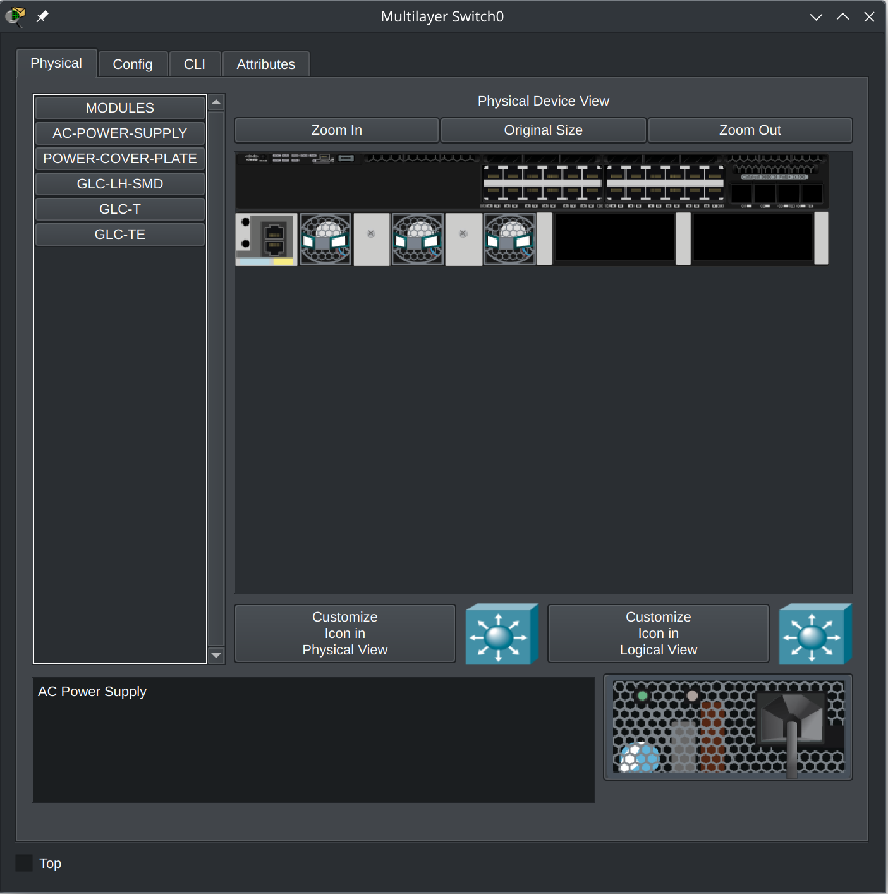

# Laboratorio de introducción a Packet Tracer

## Instalación de Packet Tracer
Para poder instalar Packet Tracer primero tenemos que crear una cuenta en https://www.netacad.com/ pulsando el botón de *Log In* que se muestra en la parte superior derecha.

Si tenemos cuenta podemos entrar directamente, pero si no la tenemos podemos crear una en la opción: *Don't have an account? **Sign up***.

Una vez completado el registro y después de entrar en nuestra cuenta, nos encontraremos una ventana como la siguiente:

De allá vamos al final de la página y seleccionamos:

Una vez descargado se procede a la instalación ejecutando el programa descargado.

Una vez instalado ya se puede arrancar la aplicación buscándola en el menú.

<mark>Es importante tener en cuenta que para usar la aplicación debemos usar el nombre de usuario y contraseña obtenido anteriormente.</mark>

Si todo ha ido bien ya tenemos la aplicación en marcha:

## Objetivo
Esta práctica está compuesta de diversas partes y tiene un objetivo doble, familiarizarse con Packet Tracer, y a su vez entender el funcionamiento básico de una red.

Las partes en las que se compone esta práctica son:
1. Despliegue básico de una red IP
2. Configuración segura de una WiFi
3. Segmentación de la red

## Introducción básica a Packet Tracer
Packet Tracer es un simulador de red. Proporciona una interfaz que permite la creación de una red, así como la configuración de los nodos y la posterior generación de tráfico donde se pueden analizar todos los detalles de la comunicación.

El funcionamiento de la User interface es bastante intuitivo, se insertan nodos en la red, se conectan entre si y se configuran. Para poder configurar un nodo se debe clickar encima de él i observar las opciones. Las más relevantes son:
- La configuración física del equipo
  - Se pueden arrastrar coponentes hardware hacia la máquina y viceversa
- La configuración software del equipo
  - Asignando direcciones MAC
  - Configurando VLAN
  - Configurando direcciones IP
  - Configurando tablas de routing

La siguiente figura muestra las dos pantallas que proporcionan esto:
 

Para poder realizar acciones Packet Tracer tiene dos modos de funcionamiento el "Real-Time" y el "Simulation". Real-Time se usa generalmente para construir la red, y el modo simulación se usa para simular eventos en la red.

### El modo simulación
Para usar el modo simulación se necesita una red montada, el sistema nos ayudará a depurar si se hace algo mal. La siguiente figura muestra una red básica con su configuración:
 

Si queremos añadir un paquete entre cliente y servidor debemos seleccionar una de las dos opciones del "toolbar"

Y de allá clickar primero al nodo que origina el paquete y otro click en el destino. Se puede observar que la acción ha funcionado en la barra de paquetes en la parte inferior derecha:

Tambien se puede simular paso a paso en el apartado simulación y pulsando el botón de play que puede verse:

## Despliegue básico de una red IP

## Configuración segura de una WiFi

## Segmentación de la red
