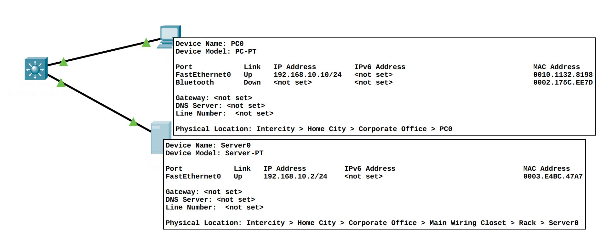

# Laboratorio de introducción a Packet Tracer

## Instalación de Packet Tracer
Para poder instalar Packet Tracer primero tenemos que crear una cuenta en https://www.netacad.com/ pulsando el botón de *Log In* que se muestra en la parte superior derecha.


Si tenemos cuenta podemos entrar directamente, pero si no la tenemos podemos crear una en la opción: *Don't have an account? **Sign up***.

Una vez completado el registro y después de entrar en nuestra cuenta, nos encontraremos una ventana como la siguiente:


De allá vamos al final de la página y seleccionamos:


Una vez descargado se procede a la instalación ejecutando el programa descargado.

Una vez instalado ya se puede arrancar la aplicación buscándola en el menú.

<mark>Es importante tener en cuenta que para usar la aplicación debemos usar el nombre de usuario y contraseña obtenido anteriormente.</mark>

Si todo ha ido bien ya tenemos la aplicación en marcha:


## Objetivo
Esta práctica está compuesta de diversas partes y tiene un objetivo doble, familiarizarse con Packet Tracer, y a su vez entender el funcionamiento básico de una red.

Las partes en las que se compone esta práctica son:
1. Despliegue básico de una red IP
1. Configuración segura de una WiFi
1. Enrutado entre subredes
1. Segmentación de la red

## Introducción básica a Packet Tracer
Packet Tracer es un simulador de red. Proporciona una interfaz que permite la creación de una red, así como la configuración de los nodos y la posterior generación de tráfico donde se pueden analizar todos los detalles de la comunicación.

El funcionamiento de la User interface es bastante intuitivo, se insertan nodos en la red, se conectan entre si y se configuran. Para poder configurar un nodo se debe clickar encima de él i observar las opciones. Las más relevantes son:
- La configuración física del equipo
  - Se pueden arrastrar coponentes hardware hacia la máquina y viceversa
- La configuración software del equipo
  - Asignando direcciones MAC
  - Configurando VLAN
  - Configurando direcciones IP
  - Configurando tablas de routing

La siguiente figura muestra las dos pantallas que proporcionan esto:
 

Para poder realizar acciones Packet Tracer tiene dos modos de funcionamiento el "Real-Time" y el "Simulation". Real-Time se usa generalmente para construir la red, y el modo simulación se usa para simular eventos en la red.

### El modo simulación
Para usar el modo simulación se necesita una red montada, el sistema nos ayudará a depurar si se hace algo mal. La siguiente figura muestra una red básica con su configuración:
 

Si queremos añadir un paquete entre cliente y servidor debemos seleccionar una de las dos opciones del "toolbar"


Y de allá clickar primero al nodo que origina el paquete y otro click en el destino. Se puede observar que la acción ha funcionado en la barra de paquetes en la parte inferior derecha:


Tambien se puede simular paso a paso en el apartado simulación y pulsando el botón de play que puede verse:


## Despliegue básico de una red IP
Para empezar se pide construir una red como la siguiente:


No hace falta que os fijéis con las direcciones MAC, lo importante es configurar el nivel IP y ser capaces de intercomunicar los dos equipos creando un mensaje (ICMP) desde el PC0 (Cliente) al Server0 (Servidor).

Guarda esta simulación en un fichero llamado `ejercicio1_1.pkt`.

## Configuración segura de una WiFi
En la segunda parte de la práctica vamos a añadir una conexión sin hilos con un laptop. Para ello deberemos hacer algunos cambios en el hardware por defecto del equipo.

El objectivo final de la práctica es tener una red como la de la figura:


Cosas a tener en cuenta. El Access Point es del tipo AP-PT. En el caso del laptop, ir con cuidado, para añadir una conexión WiFi se debe parar el ordenador (botón con luz verde en la vista física del equipo en la configuración), extraer la targeta de red Ethernet arrastrando con el ratón y añadir una targeta WiFi modo 802.11ac, no te olvides de encender de nuevo el laptop. La IP del laptop ha de ser la que queráis dentro de la subred IP del ejercicio anterior. Tened en cuenta también de configurar el sistema para soportar WPA2-PSK para la encriptación, elige la contraseña que prefieras.

De nuevo configuraremos la simulación para enviar un paquete desde el laptop hasta el servidor.

Para ver más clara la simulación se pueden esconder los paquetes que no sean importantes, para ello solo hace falta editar los filtros como muestra la siguiente figura:
.

Guarda esta simulación en un fichero llamado `ejercicio1_2.pkt`

## Enrutado entre subredes
Como siguiente paso vamos a añadir otra subred con un switch nuevo y un equipo, le asignaremos la subred `192.168.11.0/24`. Una vez hecho uniremos las dos subredes con un router. De nuevo las velocidades de los enlaces no son relevantes.

Simula el envío desde el nuevo cliente hasta el servidor. No te olvides de configurar la ruta por defecto en los equipos, así como activar los puertos del router, que por defecto están apagados. La red debería ser similar a:


Guarda esta simulación en un fichero llamado `ejercicio1_3.pkt`

## Segmentación de la red
Dado que la red en el modo que está actualmente requiere dos switches, con tal de minimizar el uso de hardware se propone unir las dos subredes en un solo switch con las correspondientes VLAN.

Por desgracia Packet Tracer no permite la configuración automática de VLAN en los router por UI, tiene que hacerse a través de la línea de comandos, es por esto que se detallan los pasos para realizar la configuración paso a paso:
1. Crear un router tipo `4321`
1. Una vez creado el router lo conectaremos al switch, la imagen final debería ser parecida a: 
1. Entrar en el CLI del router y ejecutar:
```
enable
configure terminal
interface GigabitEthernet0/0/0.10
 encapsulation dot1Q 10
 ip address 192.168.10.1 255.255.255.0
!
interface GigabitEthernet0/0/0.11
 encapsulation dot1Q 11
 ip address 192.168.11.1 255.255.255.0
!
```
  - Esto asociará a la interfaz `GigabitEthernet0/0/0` dos VLAN, la 10 y la 11, creando dos subinterfaces. Conviene asegurarse a qué interfaz del router se ha conectado el cable del switch para asegurarse que funciona correctamente.

También es importante garantizar que las direcciones IP del Gateway de los equipos coinciden con las especificadas en las interfaces.