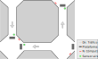
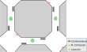

# Diseño de red para una Smart-city
Este ejercicio tiene por objetivo entender como puede diseñarse a grandes rasgos una red en un entorno smart-city, así como proporcionar los diferentes controles de seguridad, para poder minimizar el riesgo que un ataque cibernético tenga éxito.

## Introducción

Una Ciudad quiere mejorar la vida de sus ciudadanos proporcionando una serie de servicios integrados en la propia ciudad. El objetivo es proporcionar dichos servicios de la forma más segura posible, por ello, definen una serie de requisitos y componentes que formarán toda la solución.

A nivel de ciudad se quieren ofrecer las siguientes funcionalidades:
- *Monitorización del tráfico de vehículos por las calles principales*: así en el futuro se podrán optimizar los semáforos y buscar estratégias para reducir la contaminación en las calles
- *Smart-GRID*: uso eficiente de la energía eléctrica
- *Recogida de las basuras inteligente*: para poder reducir el ruido durante la recogida y al mismo tiempo reducir el coste de la recogida diaria

[//]: <> (- *Alumbrado inteligente*: con el objetivo de reducir el consumo eléctico y minimizar la contaminación lumínica de la ciudad)

[//]: <> (- *Riego automatizado y eficiente en los jardines*: para poder reducir el consumo de agua y maximizar el buen estado de los jardines)

Inicialmente cada una de estas partes se va a desarrollar por separado, para posterormente plantear la solución que pueda integrarlas de forma segura.

<mark style="background-color: purple"><b>Nota:</b> Es importante remarcar que este ejercicio plantea un escenario ficticio, cualquier relación con la realidad es mera coincidencia</mark>

## Entorno de desarrollo del proyecto
El entorno en el que se desarrollará este problema se divide en dos partes, la infraestructura física que se va a usar y los servicios que van a ofrecerse sobre ella.

Esta sección detalla la infraestructura general, para cada una de las diferentes funcionalidades se van a ofrecer los detalles más adelante.

El objetivo final es diseñar la red para poder ofrecer el servicio requerido. Para ello el diseño debe considerar los siguientes puntos:
- Mínima exposición de servicios al exterior
- Protección en diversos niveles:
- **Nivel de sensores**:
  - Debe especificarse la tecnología física utilitzada para el acceso.
    - Detallar qué mecanismos de seguridad ofrece este nivel para poder garantizar: privacidad, integridad y disponibilidad
  - Qué mecanismos de protección van a usarse a nivel de red y transporte en caso de ser posible.
  - Que protocolo de aplicación va a usarse para comunicar las métricas en cada uno de los casos

- **Nivel de edge y de cómputo**:
  - Como va a diseñarse la capa física y de enlace de datos de la red para poder minimizar los movimientos laterales y la expansión en el caso de una brecha en la seguridad del sistema
  - Qué mecanismos a nivel de red van a proporcionar aislamiento y reducción de la superfície de ataque
  - Como van a protegerse las aplicaciones en este nivel

- **Nivel de cloud**:
  - Que diferencia implica la securización de este nivel respecto al resto. Recuerda que en la nube no tenemos infraestructura física, la parte visible para los usuarios y operadores es toda virtual.

### Infraestructura
La infraestructura de la ciudad va a instalarse inicialmente en cuatro niveles:
- *Nivel de sensores*: se van a instalar en la ciudad al sitio físico donde se necesiten los datos o la actuación particular.
- *Nivel de cómputo localizado*: en una ubicación cercana a los sensores que controlan con información localizada. Pero con posibilidad de preguntar o ser afectado por nodos de nivel superior.
- *Nivel de cómputo avanzado*: permite globalizar la información de los nodos de cómputo localizado, en este entorno pueden afectar a nivel de toda la ciudad o a nivel de distrito dependiendo de la situación.
- *Nivel de agregación global*: agrega toda la información de cómputo avanzado y da una visión a nivel de servicios y ciudad.

### Actores
- **Operadores**: están a cargo del mantenimiento de la infraestructura, deben poder acceder a todos los servicios, así como poder modificar la configuración del sistema.
- **Usuarios**: son los actores humanos que tienen una cuenta en el sistema y pueden consultar con permisos de solo-lectura todos los datos presentes en la infraestructura.
- **Visitantes**: actores humanos que no tienen ningún tipo de privilegio y solo pueden ver la información pública de la infraestructura.

### Servicios
Todos los servicios funcionan de forma similar:
- Los sensores se comunican con la infraestructura usando su transporte físico y a través de MQTT hacia su nodo de computación local. <mark style="background-color: green">La comunicación entre los sensores y los nodos tiene que ser segura por diseño, y solo los operadores han de poder acceder a ella.</mark>
- Los nodos de computación local utilizan un sistema con los siguientes servicios:
    - Almacenamiento de datos con una base de datos tipo `postgresql`
    - Sistema de monitorización de la infraestructura con `prometheus`
    - Análisis de datos para ofrecer los datos agregados a las capas superiores
    - Sistema de consultas de la infraestructura de solo lectura a través de una API web mediante `nginx`
    - <mark style="background-color: green">Estos servicios solo están directamente disponibles para los operadores</mark>, la excepción a este punto es el sistema de consultas, que está disponible desde los nodos de computación avanzados a los usuarios que se hayan autenticado a la plataforma
- Los nodos de computación avanzada actuan como agregadores de más alto nivel, en este caso pueden acceder a ellos todos los usuarios autenticados, pero no pueden acceder los usuarios visitantes. Los servicios ofrecidos por este nivel son:
    - Almacenamiento de datos con una base de datos tipo `postgresql`
    - Sistema de monitorización de la infraestructura con `prometheus`
    - Visualización y exportación de los datos a través de `grafana`
    - Análisis de datos avanzado
    - Sistema de autoescalado para poder soportar la carga del sistema con `docker` y `kubernetes`
    - Sistema de consultas para la exposición de datos públicos a través del sistema cloud
    - <mark style="background-color: green">Estos servicios solo están directamente disponibles para los operadores en modo lectura y escritura y usuarios registrados en modo solo-lectura</mark>
- Los nodos globales, generalmente en la nube, con la agregación de todos los datos procesados, pueden ofrecer tres tipos de acceso:
    - Descarga de ficheros y OpenAPI a usuarios visitantes con información genérica y de solo lectura. Todo a través de un sistema web con `nginx`
    - Acceso a datos restringidos a los usuarios registrados, también a través de un sistema `nginx`
    - Acceso a la infraestructura de control de la nube para operadores. Basada en servicios web en la nube y `ssh`.

## Parte I: Monitorización del tráfico de vehículos
Con el objetivo de obtener estadísticas sobre el uso de vehículos en la ciudad, se propone instalar un sistema de contaje de vehículos, así como un sistema para poder cuantificar la contaminación que suponen para la salud de la ciudadanía con sensores de detección de la calidad del aire en los semáforos.

Para ello se dotan las calles con unas plataformas instaladas en la salida de los semáforos. Dichas plataformas son capaces de contar vehículos y transmiten los siguientes datos:
```
{
   "id": "identificador de la plataforma que envía los datos",
   "weight": "peso en kilogramos",
   "timestamp": "hora en la que ha pasado el vehículo"
}
```

La plataforma envía esta información por cada vehículo detectado. La plataforma usa una red *Ethernet a 10Mbps* para el envío de los datos, y tiene integrado un microcontrolador con un pequeño sistema operativo integrado que permite realizar operaciones con la información.

Los sensores de calidad del aire se conectan a través de `zigbee` a los nodos de cómputo, donde hay un gateway zigbee preinstalado.

Las plataformas y los sensores están directamente conectadas con un nodo de cómputo en cada esquina de las calles como muestra la siguiente figura:



El nodo de cómputo tiene una base de datos en la que hay la relación de cada plataforma con la ubicación física en la calle, lo que permite correlacionar el flujo de tráfico y ubicarlo en el mapa de la ciudad.

### Tarea:
Se pide diseñar la red teniendo en cuenta las consideraciones explicadas anteriormente, así como los siguientes puntos:

- **Seguridad al acceso a la red**: se requiere que el envío de la información a nivel de los nodos de red solo podrá realizarse por los nodos conocidos, así que un atacante malicioso nunca pudiera insertar mensajes en la red. Así se pide:
  - Determinar qué funcionalidades a nivel del acceso a la red se podrían usar para el reporting de los sensores y de las plataformas
  - Determinar qué tecnologías de red y transporte se podrían usar para minimizar el impacto en el reporte de los datos
- **Seguridad de la plataforma de cómputo**: se requiere que toda la plataforma esté lo más protegida posible, dado que está conectada a la red de la ciudad se requiere:
  - Limitar el acceso a los sistemas a los nodos avanzados habilitados al efecto
  - Monitorizar los sensores y todos los equipos de la red para detectar posibles intrusiones
- **Seguridad de los nodos avanzados**: tiene unos requisitos de seguridad iguales a los nodos de cómputo local, la diferencia es que se conecta a la nube y a los nodos locales.
- **Seguridad en la nube**: esquema similar pero en este caso cualquier usuario debería poder conectarse para autentificarse y usar la plataforma

Ahora una vez hecho el análisis te tecnologías previo indica el esquema de red y como se protegería sabiendo que los nodos de cómputo necesitan:
- El servidor de la base de datos (PostgreSQL)
- El nodo de análisis de datos: aplicación python con pandas
- Sistema de administración de la plataforma: usa un servidor web NGINX que ofrece una API al sistema central y un agente local que permite la configuración de toda la plataforma local.

Los nodos de cómputo avanzado y la nube tienen los requisitos indicados en apartados anteriores.

No te olvides de garantizar el acceso de los operadores.

## Parte II: Smart-GRID en los edificios públicos
Financiado por fondos europeos el ayuntamiento ha decidido, con el objetivo de reducir el gasto en electricidad, dotar los edificios de un sistema eléctrico inteligente.

Cada edificio dispondrá en el tejado de placas solares, que se encargarán de la calefacción y del aire acondicionado de los edificios. Para poder mostrar al público el ahorro energético que esta nueva infraestructura representa, se proporciona al ciudadano un portal donde puede verse en tiempo real la temperatura de cada sala de cada edificio, junto con el consumo que supone el sistema, así como el histórico y la previsión de consumo y temperatura.

**Requisito**: Cabe remarcar que los operadores de la infraestructura a parte de ver el estado, deben poder cambiar la configuración del sistema.

El sistema que se ha utilizado para poder gestionar la plataforma es:
- Visualización de los datos desde la nube:
   - PostgreSQL
   - Grafana con un servidor web con NGINX
   - <mark style="background-color: green"><b>Nota</b>: Desdel punto de vista del diseño solo es necesario tener en cuenta que la única parte que ha de ser visible de esta infraestructura es NGINX</mark>
- Gestión de la infraestructura: dado que hay pocos edificios que tendrán esta funcionalidad los nodos de cómputo local actúan también como nodos de computo avanzado en el mismo edificio, y se conectan directamente a la nube.
  - Sistema propietario del fabricante del sistema de placas solares y aerotérmia, está formado por:
     - Base de datos con PostgreSQL
     - Sistema de recepción de los datos mediante MQTT
     - Servicio Web para la publicación de datos
     - Consola de administración de los equipos centralizada por edificio.

### Tarea:
Se pide diseñar la red teniendo en cuenta las consideraciones explicadas anteriormente, así como los siguientes puntos:

- **Seguridad al acceso a la red**: se debe limitar el acceso a la red a los nodos conocidos. En este caso el sistema al ser local está todo conectado con el sistema *Fast Ethernet* a 100Mbps.
  - Determinar qué funcionalidades a nivel del acceso a la red se podrían usar para el reporting de estado del sistema
  - Determinar qué tecnologías de red y transporte se podrían usar para minimizar el impacto en el reporte de los datos
- **Seguridad de la plataforma de cómputo**: se requiere que toda la plataforma esté lo más protegida posible, dado que está conectada a la red de la ciudad se requiere:
  - Limitar el acceso a los sistemas a los nodos avanzados habilitados al efecto
  - Monitorizar los sensores y todos los equipos de la red para detectar posibles intrusiones
  - Proporcionar la consola de control para los operadores
  - Proporcionar una API desde la nube para poder operar la infraestructura por los operadores y poder consultar el estado de todo por los usuarios
  - Debe denegarse el acceso a los visitantes
- **Seguridad en la nube**: esquema similar pero los visitantes pueden acceder al panel de Visualización general de la plataforma.
  - Indicar como puede ofrecerse seguridad, permitiendo a la vez que los operarios y usarios puedan controlar y visualizar la infrastructura a través de las API.

## Parte III: Recogida de las basuras inteligente
Para optimizar el recorrido de los camiones se han colocado unos sensores en los contenedores que, mediante MQTT reportan el nivel de llenado de los mismos. Estos sensores tienen un alcance de aproximadamente 100m, por lo que se colocará un centro de cálculo básico en cada esquina para cubrir los contenedores tal y como muestra la figura.



Cada día, el centro de cálculo de cada esquina reporta a los nodos centrales el estado de cada contenedor, esta información se alimenta a un sistema de inteligencia artificial que diseñará el recorrido óptimo de los camiones.

A su vez, cada camión estará geolocalizado a través de GPS y tecnología 5G para el seguimiento activo y preciso de toda la flota.

El sistema tiene por objetivo:
- Control de la flota
- Medición del nivel de basura en los contenedores

La plataforma de cómputo en este entorno se limitará a la agregación de datos con la base de datos `mysql`, que serán reportados directamente a la nube.

### Tarea:
Se pide diseñar la red teniendo en cuenta las consideraciones explicadas anteriormente, así como los siguientes puntos:

- **Seguridad al acceso a la red**: los contenedores están dotados de sensores usando la teconolgía WiFi
  - Determinar qué funcionalidades a nivel del acceso a la red se podrían usar para el reporting de estado del sistema
  - Determinar qué tecnologías de red y transporte se podrían usar para minimizar el impacto en el reporte de los datos
- **Seguridad de la plataforma de cómputo**: se requiere que toda la plataforma esté lo más protegida posible, dado que está conectada a la red de la ciudad se requiere:
  - Limitar el acceso a los sistemas a los nodos avanzados habilitados al efecto
  - Monitorizar los sensores y todos los equipos de la red para detectar posibles intrusiones
  - Proporcionar la consola de control para los operadores
  - Proporcionar una API desde la nube para poder operar la infraestructura por los operadores y poder consultar el estado de todo por los usuarios
  - Debe denegarse el acceso a los visitantes
- **Seguridad en la nube**: esquema similar pero los visitantes pueden acceder al panel de Visualización general de la plataforma.
  - Indicar como puede ofrecerse seguridad, considerando que el sistema debe permitir la entrada de datos emitidos mediante GPS en los camiones.

[//]: <> (## Alumbrado inteligente)

[//]: <> (## Riego automatizado y eficiente en los jardines)

[//]: <> (- Detectores de humedad en el suelo)
[//]: <> (- Previsión de las temperaturas y de las lluvias)

## Juntando toda la infraestructura
En una segunda iteración y para ahorrar recursos se nos pide de permitir que las tres infraestructuras puedan compartir recursos de forma inteligente, es por ello que se pide que se rediseñe la red para minimizar el coste y permitir dicha compartición, pero siempre garantizando la seguridad, ya que los gestores de cada una de las partes es diferente.
